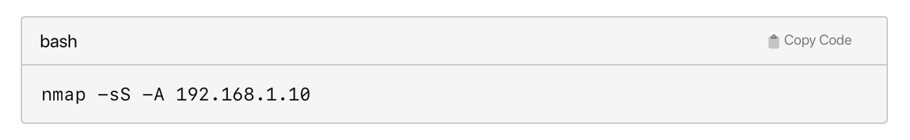

**Taller Practico - Amor**

🔹 DESCRIPCION DEL LABORATORIO

1. Se copio el laboratorio a Kali

2. Se instalar Docker

3. Se desplego el laboratorio - maquina vulnerable

cuando se logro identificar nuestra red pasamos a escanear la IP con Nmap. Esto nos dio la información de los puertos que estaban abiertos.

6. Se exploro el puerto 80, esto nos arrojo la IP.
Se abrio en el navegador: http://172.17.0.2

8. Pasamos al Fuzzing con Gobuster

9. Efectuamos la conexion por SSH.

10. Se identifico el archivo oculto

11. Descargamos la imagen al host

12. Identificamos el tipo de archivo

13. se realizo la prueban de esteganografía

14. Decodificamos la contraseña

15. Finalmente se escalaron privilegios.

🔹 CUADRO DE HERRAMIENTAS EMPLEADAS
| **Herramienta** | **Definición** | **Funcionalidad Principal** | **Casos de Uso Comunes** |
|----------------|----------------|-----------------------------|---------------------------|
| Docker | Plataforma de contenedores que permite empaquetar y ejecutar aplicaciones de forma aislada. | Permite crear entornos virtuales ligeros (contenedores) para pruebas, despliegues o simulaciones. | Laboratorios de ciberseguridad, entornos de desarrollo, despliegue continuo (CI/CD). |
| scp | Comando de Linux para copiar archivos/directorios de forma segura entre dos equipos usando SSH. | Transfiere archivos cifrados a través de la red de manera recursiva y autenticada. | Migración de scripts, copia de respaldos, despliegue de configuraciones remotas. |
| netdiscover | Herramienta de descubrimiento de red basada en ARP para identificar hosts activos en redes LAN. | Detecta dispositivos conectados mostrando IP, MAC y vendor de forma rápida y pasiva. | Reconocimiento de red, identificación de objetivos, escaneo previo en pentesting. |
| nmap | Scanner de redes avanzado que permite descubrir puertos abiertos, servicios y sistemas operativos. | Realiza escaneos TCP/UDP, identifica servicios y versiones, detecta vulnerabilidades. | Auditorías de seguridad, evaluación de infraestructura, descubrimiento de red. |
| gobuster | Herramienta para fuerza bruta de rutas/archivos en servidores web basada en diccionarios. | Envía solicitudes HTTP con rutas comunes para descubrir contenido oculto. | Enumeración de directorios ocultos, rutas administrativas, pruebas de pentesting web. | 
| hydra | Herramienta de cracking para servicios remotos que permite ataques de fuerza bruta con múltiples protocolos. | Automatiza intentos de autenticación contra servicios como SSH, FTP, HTTP, RDP, etc. | Test de contraseñas débiles, auditoría de accesos, ejercicios de Red Team. |
| steghide | Herramienta de esteganografía para ocultar/extractar datos en archivos de imagen o audio. | Inserta o recupera archivos dentro de imágenes (JPG, BMP) o audio (WAV, AU). | Captura de bandera (CTF), análisis forense, comunicaciones encubiertas. |
| base64 | Método de codificación de datos que convierte binarios en texto ASCII legible. | Codifica/decodifica datos para transferencia segura o almacenamiento textual. | Decodificación de mensajes, análisis forense, manipulación de archivos en texto plano. |

🔹 DESGLOSE DE COMANDOS UTILIZADOS.

Desglose:

-sS: Realiza un escaneo SYN (stealth scan), menos detectable.
-A: Habilita la detección de sistema operativo, versión, scripts y traceroute.
192.168.1.10: IP objetivo.

Variantes y alternativas:

nmap -sV 192.168.1.10 — Detecta versiones de servicios.
nmap -O 192.168.1.10 — Detecta el sistema operativo.
nmap -p- 192.168.1.10 — Escanea todos los puertos.

Alternativas:

masscan (más rápido para escaneos masivos)
angry IP scanner (interfaz gráfica)
unicornscan (escaneo avanzado y flexible)

 Desglose:

-n: No resuelve nombres DNS.
-v: Modo verbose (detallado).
192.168.1.10: IP objetivo.
80: Puerto objetivo.

Variantes y alternativas:

nc -lvp 4444 — Escucha en el puerto 4444 (modo servidor).
nc -u 192.168.1.10 53 — Usa UDP en vez de TCP.
nc -zv 192.168.1.10 1-1000 — Escaneo de puertos (sin enviar datos).

Alternativas:

socat (más opciones de redirección y cifrado)
ncat (versión mejorada de netcat, parte de Nmap)
telnet (para conexiones simples a puertos TCP)

 🔹 DIAGRAMA

 
 
 
