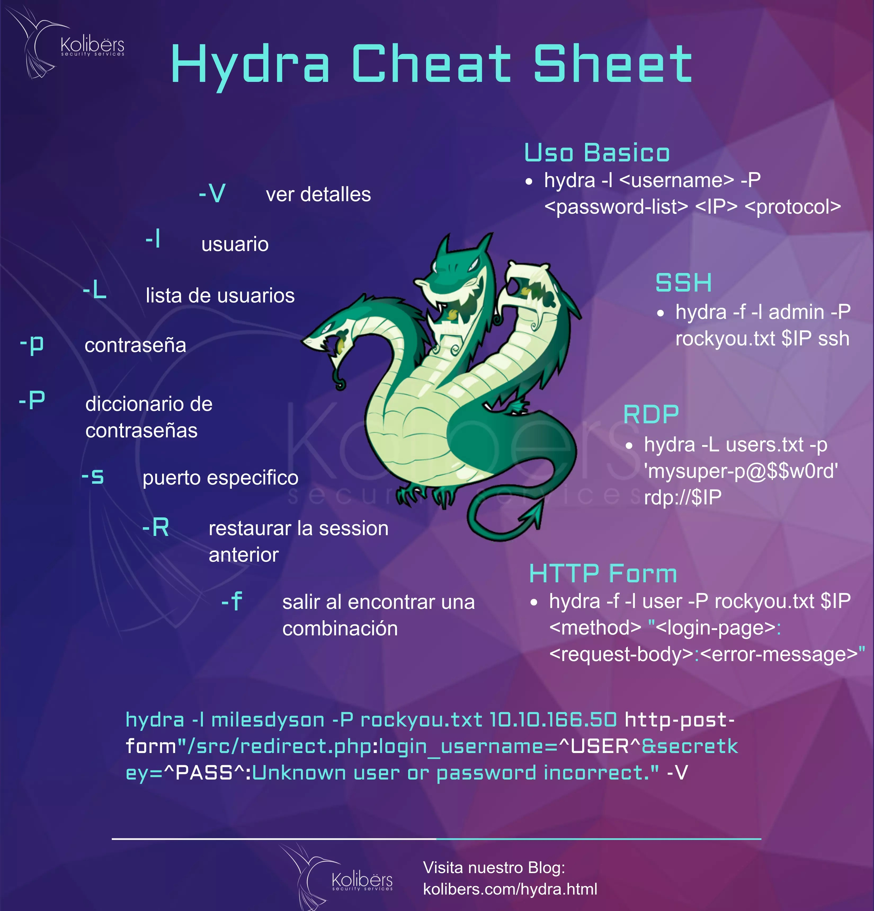

## Ejercicio Individual en Clase.

De manera individual responder de acuerdo al elemento de estudio en clase ( https://www.kolibers.com/blog/hydra-herramienta-de-fuerza-bruta.html)  las siguientes preguntas.

1. ¿Qué es Hydra y para qué se utiliza principalmente en el ámbito de la seguridad informática?

2. Menciona al menos tres protocolos que soporta Hydra para realizar ataques de fuerza bruta.

3. ¿Cuál es la diferencia entre los parámetros -l y -L en Hydra?

4. Explica el propósito del parámetro -P y da un ejemplo de su uso en un comando.

5. ¿Qué indica el parámetro -t en Hydra y por qué podría ser importante modificar su valor?

6. ¿Cómo se puede utilizar Hydra para atacar formularios de inicio de sesión web? Describe brevemente el proceso.

7. ¿Qué significa el parámetro -f y en qué situaciones es recomendable usarlo?

8. ¿Por qué es importante identificar el mensaje de error al fallar un login cuando se ataca un formulario web con Hydra?

9. ¿Qué consideraciones éticas y legales se deben tener en cuenta antes de usar Hydra?

10. Da un ejemplo de un comando de Hydra para atacar un servicio SSH, indicando el significado de cada parámetro utilizado.
